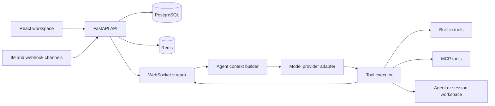

# TClaw Agent Platform Case Study

> A sanitized engineering case study of an enterprise multi-agent platform built as a secondary development on top of the open-source Clawith project.

This repository intentionally contains **documentation only**. It does not include proprietary company source code, credentials, customer data, tenant data, private prompts or deployment configuration.

## Product context

The platform is designed as a digital-employee and multi-agent workspace for enterprise training and operations scenarios.

Each Agent can have:

- A persistent identity and role description
- Long-term memory and reusable skills
- A private workspace for generated artifacts
- A controllable tool set
- Collaboration relationships with other Agents
- Implicit or scheduled triggers
- Per-tenant model, quota, permission and audit settings

## My contribution boundary

The open-source Clawith platform provides the Agent runtime, tool loop, MCP client, channel integrations and base multi-agent concepts.

My work focused on enterprise delivery and productization:

- Enterprise OIDC SSO with PKCE, identity binding and JIT tenant provisioning
- Tool governance for enterprise data access
- Six structured content-artifact tools
- Workspace preview, editing and export flows
- Session-level workspace isolation
- Multi-tenant configuration, quotas and audit-related extensions
- Reliability, testing and deployment hardening

I do not claim to have written the Clawith runtime from scratch.

## Architecture

More detail:

- [Architecture](docs/architecture.md)
- [OIDC SSO](docs/oidc-sso.md)
- [MCP tool governance](docs/mcp-tool-governance.md)
- [Content artifact pipeline](docs/content-artifacts.md)
- [Workspace isolation](docs/workspace-isolation.md)
- [Security and observability](docs/security-observability.md)
- [Interview story](docs/interview-story.md)
- [Demo script](docs/demo-script.md)

## Scope and boundaries

This case study describes the implementation pattern and engineering decisions. Details that could expose company or customer information have been removed.

The public repository is not intended to be runnable. It exists to make the architecture and contribution verifiable during interviews without redistributing proprietary source code.
