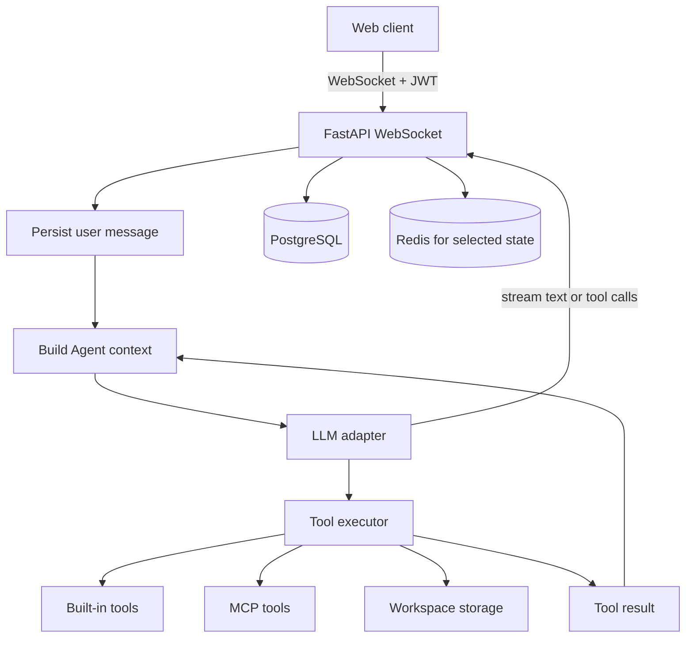

# Architecture

## Runtime components

## One chat turn

1. The client connects to `GET /ws/chat/{agent_id}` with a JWT and optional session ID.
2. The server validates the token and Agent access.
3. The user message is persisted.
4. `build_agent_context` assembles static and dynamic context:
   - Agent role and persona
   - Long-term memory summary
   - Skill index
   - Current user identity
   - Collaboration and workspace context
5. The model adapter streams text or reasoning chunks.
6. If the model requests a tool:
   - arguments are validated
   - the server executes the tool
   - the result is appended as a tool message
   - the model is called again
7. The loop stops when the model returns a final answer or reaches the configured maximum tool rounds.
8. Assistant messages, tool calls and token usage are persisted or audited.

## Design decisions

### WebSocket instead of request-only SSE

The product needs bidirectional control:

- stream model output
- stream tool progress
- stream reasoning status
- cancel an in-progress generation

### Tool execution is server-owned

The model chooses a tool name and arguments, but the server owns:

- tool availability
- authorization
- tenant resolution
- path resolution
- output sanitization
- audit records

### Prompt context is assembled server-side

The client does not construct the final system prompt. A single context builder combines system policy, durable Agent context and per-turn information.

### Stop conditions are explicit

- maximum tool rounds
- user cancellation
- token quota exceeded
- invalid tool arguments
- tool failure returned to the model for a bounded retry

## Failure handling

- Tool errors are returned to the model as structured observations instead of crashing the stream.
- Empty arguments for tools that require input are rejected and returned to the model.
- Token quotas stop expensive loops before another round.
- Cancellation interrupts the active LLM task and prevents further tool execution in that turn.
