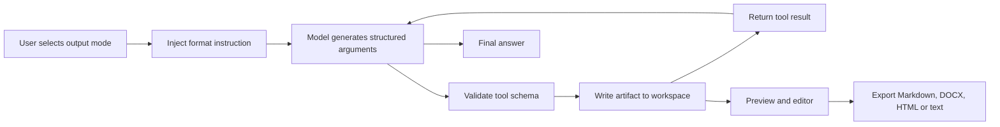

# Content Artifact Pipeline

## Goal

Convert model output into structured, reviewable and exportable files instead of leaving it as a chat response.

## Supported output modes

| Mode | Tool | Default workspace target |
|---|---|---|
| Document | `create_document` | `workspace/document.md` |
| Mind map | `create_mindmap` | `workspace/mindmap.mindmap` |
| Slides | `create_slides` | `workspace/slides.html` |
| Quiz | `create_quiz` | `workspace/quiz.quiz` |
| Video script | `create_video_script` | `workspace/script.video` |
| Webinar outline | `create_webinar` | `workspace/webinar.webinar` |

## End-to-end flow

## Why Function Calling instead of parsing free text

- The output format is explicit.
- Required fields can be validated.
- Tool failures can be returned to the model for correction.
- Artifacts have a stable path and can be previewed.
- The same prompt can drive different output modes without client-side text parsing.

## Failure cases

- Model returns malformed arguments
- Model forgets to call the expected tool
- Generated HTML is incomplete
- File path attempts to escape the workspace
- Output exceeds the editor's size limit
- User cancels during generation
