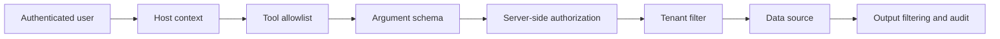

# MCP Tool Governance

## Principle

MCP standardizes how tools are discovered and invoked. It does not remove the need for authorization.

The model is not a trusted identity source. The server must bind every tool call to the authenticated platform user and server-resolved tenant.

## Tool layers



## Enterprise data-tool rules

- Do not expose a universal SQL or proxy tool.
- Split tools by business action rather than by database table.
- Enforce tenant and role filters inside the data service.
- Do not accept `tenant_id` or `user_id` from model-generated arguments.
- Return only the fields required by the task.
- Treat exports of sensitive fields as a separate high-risk action.
- Record tool name, actor, tenant, arguments class, result status and latency.

## MCP integration risks

- External MCP server availability and timeouts
- Credential storage and rotation
- Prompt injection in tool descriptions or returned content
- Over-broad tool schemas
- Cross-tenant data leakage
- Unbounded output size
- Side-effecting tools being retried

## Example tool boundary

Instead of:

```text
query_database(sql)
```

Use bounded actions:

```text
get_employee_count(organization_id)
list_departments(organization_id)
get_course_completion_summary(course_id, organization_id)
generate_operational_report(report_type, date_range)
```

The server injects the authenticated tenant and applies permission checks before querying data.
