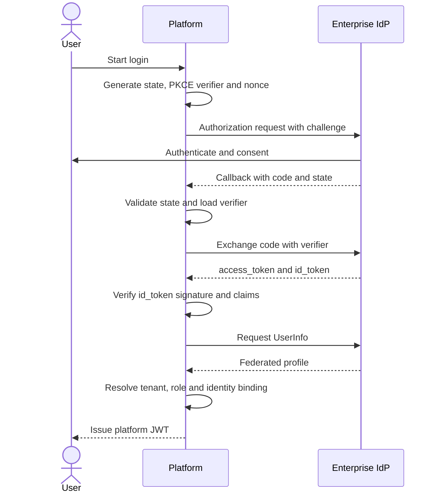

# Enterprise OIDC SSO

## Goal

Allow enterprise users to sign in through an external OIDC provider and map the federated identity to a platform user, tenant and role without trusting user-supplied tenant parameters.

## Authorization Code + PKCE flow

## Security checks

- `state`: binds the callback to the browser login attempt and prevents CSRF-style callback substitution.
- PKCE verifier and challenge: prevents an intercepted authorization code from being redeemed by another client.
- `nonce`: binds the ID token to the original login request.
- ID token signature and claims: issuer, audience, expiry and nonce must be validated.
- UserInfo cross-check: important identifiers must be consistent with the ID token.
- Tenant resolution is performed server-side. A client-provided tenant ID is not authoritative.
- Conflicts in identity binding are rejected rather than silently merged.

## Identity binding levels

The platform uses an ordered lookup strategy:

1. `(issuer, subject)` — strongest federated identity key.
2. `(tenant, student or employee ID)` — enterprise business identity.
3. `(tenant, national or document ID)` — fallback business identity where legally appropriate.

If a business identifier already maps to a different subject, the login fails with a conflict. This prevents account takeover and cross-tenant identity merging.

## JIT provisioning

A first-time enterprise administrator may receive a just-in-time tenant provisioning flow. Regular members are created inside the resolved tenant with a member role.

The platform then issues its own short-lived JWT for API and WebSocket access.

## Production hardening required

The captured implementation uses an in-memory store for state, nonce and PKCE verifier as a development baseline. A production deployment should use:

- Redis or an encrypted signed cookie
- one-time consumption and short TTL
- rate limiting
- replay detection
- structured security audit events
- secret management for OIDC client credentials
