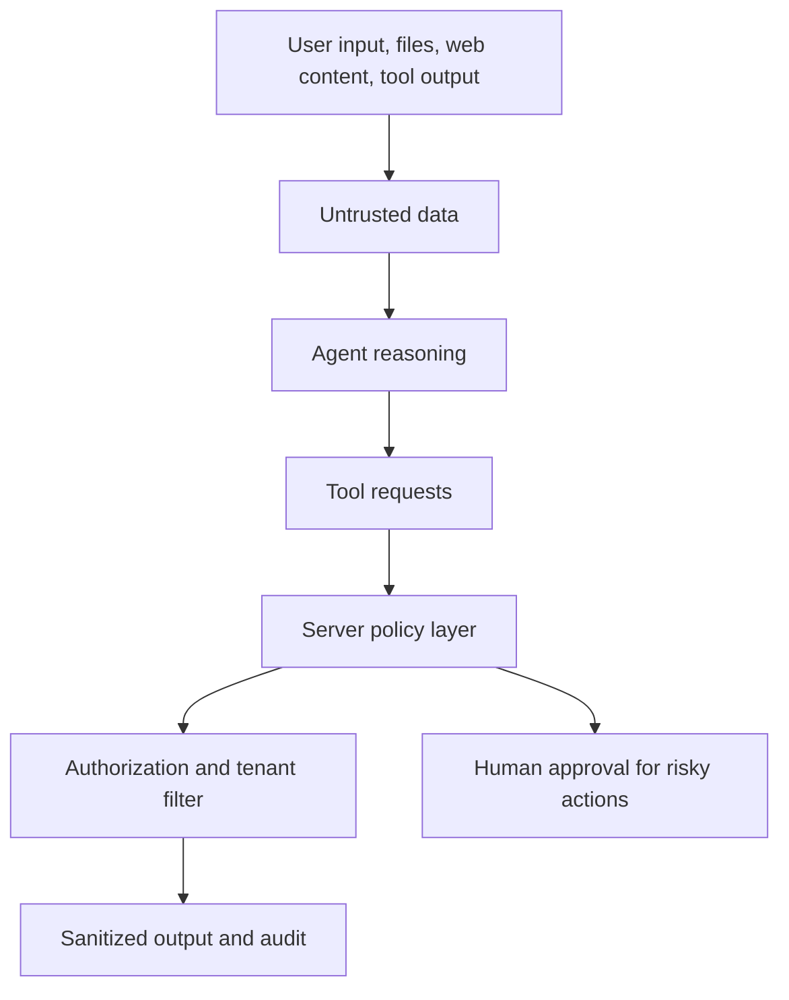

# Security and Observability

## Security map

## Protection layers

### Identity

- JWT for platform API and WebSocket access
- Enterprise OIDC for federated login
- Server-side tenant binding
- No client-provided tenant as an authority source

### Tool calls

- Tool allowlist and explicit schema
- Argument validation
- Server-side permission checks
- Bounded loop count
- Human confirmation for irreversible or external side effects

### Workspace

- Single path-resolution gate
- Session or Agent isolation
- No unrestricted filesystem access
- Export and delete operations audited

### Model and context

- Treat retrieved documents, webpages and tool responses as untrusted data
- Do not allow retrieved content to override system policy
- Limit context size and model output
- Record token usage and quota decisions

## Observability

Recommended dimensions:

- Request and trace ID
- Agent, tenant, user and session identifiers
- Model and provider
- Time to first token
- Total latency
- Input, output and cached tokens
- Tool name, duration and result status
- Tool-loop round count
- Cancellation and timeout count
- Quota rejection count
- Fallback-model usage

## Audit events

- Login and identity binding
- Tenant or role change
- Model configuration change
- Tool installation or permission change
- File export or deletion
- High-risk Agent actions
