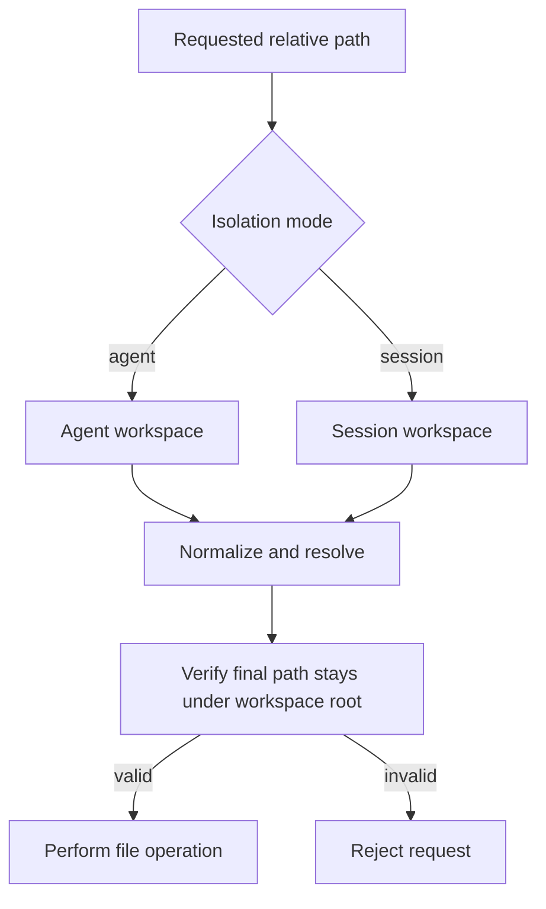

# Workspace Isolation

## Problem

Multiple Agents and chat sessions can create files with the same relative path. Without isolation, one session can read, overwrite or delete another session's artifacts.

## Isolation modes

- Agent mode: all sessions share the Agent workspace.
- Session mode: every session receives an independent workspace directory.

The Agent records the chosen `workspace_isolation_mode` when it is created, so the behavior is stable across turns.

## Single path gate

All file-oriented tools and REST APIs use the same path-resolution function. This reduces the chance that one endpoint forgets to enforce isolation.

## Security properties

- Prevent `..` traversal
- Prevent absolute-path escape
- Keep session artifacts separate
- Apply the same path rules to read, write, upload, download, search and delete
- Avoid trusting a model-generated path without validation
